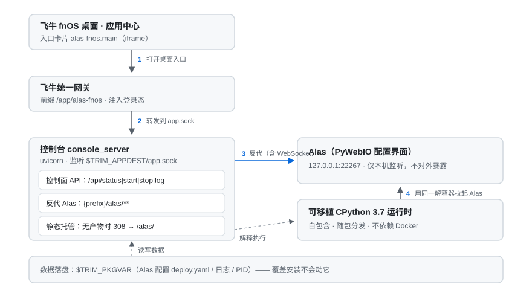

# ALAS FnOS 版

看到[MAA](https://github.com/mydanyi/MAA-FnOS)上架了飞牛商店，我就想着我们[ALAS](https://github.com/LmeSzinc/AzurLaneAutoScript)也不能落下啊！想到就做，跟AI battle了一个晚上的结果就是这个项目了，这个README.md其实也是AI生成（笑）。

不过我没有将 redroid 打包进来，我觉得还是纯粹一点比较好，redroid 建议还是 Docker 构建后手动连接。

本项目把 [AzurLaneAutoScript](https://github.com/LmeSzinc/AzurLaneAutoScript)（Alas）  
打包成飞牛 fnOS 的原生应用（`.fpk`）。安装后桌面上会多一个  
**ALAS** 图标，点开就是 Alas 自己的配置界面：配任务、看实时日志，  
手机浏览器打开也能用，7x24 挂机交给 NAS。

Python 运行时和 adb 都是打在包里的，**不用 Docker，也不用在飞牛上装任何依赖**。

---

## 怎么装

1. 到 [Releases](../../releases) 下载最新的 `alas-fnos_*.fpk`（约 344 MB）
2. 打开飞牛 **应用中心**，点左下角的 **手动安装**
3. 选好存储空间，把 fpk 传上去（文件已经在 NAS 上，就点 **从 NAS 添加**）
4. 装完在应用中心点启动，再点桌面上的 **ALAS** 图标

它挂在飞牛自己的统一网关后面，不用记端口，也不占端口 —— 桌面那个图标点开就能用。

出新版就用同样的方式再装一次新包。Alas 的配置、日志都存在应用私有数据目录里，  
覆盖安装不会动它。**卸载时会问你要不要清数据**，默认保留，想彻底清空就选「删除全部数据」。

### 更新方式

有两条路，按需要选：

**1. 更新 Alas 脚本 —— 直接在界面里点**

Alas 自带那个「检查更新 / 立即更新」按钮**是真的能用的**。上游 Alas 一更新（主要是新地图适配），  
你在 Alas 的更新面板点一下就能换到最新版，**不用重装 fpk**。

做法上没有照搬上游的 git 流程（包里不带 `git`、不带 `.git`、安装目录也只读），而是保留了上游的  
界面和按钮，只把底下的数据来源换掉了：版本探测优先取官方提交列表（与配置界面里的提交历史  
同源），取不到才回退到镜像的 91 字节小文件；更新时下载一份源码包，校验通过后**原子交换**到  
应用私有数据目录，旧版本留一份备用。更新完会自动重启并加载新代码。

配置和日志**不会丢** —— 它们本来就在数据目录里，和源码树分开存。

如果面板显示「更新失败」，那就是**真的没查到上游**（网络不通或证书问题），不是「没有更新」；  
点重试或稍后再试即可。日志里搜 `[alas-fnos]` 能看到每次检查的本地/上游版本与具体报错。

还有两点要知道：

- **依赖不会跟着更新。** 包里的 Python 依赖是打包时钉死的，上游新版如果引入了新依赖，  
  更新后 Alas 会起不来。真遇到了就调 `POST /app/alas-fnos/api/alas/reset` 回到出厂版本。  
  这是「自带运行时、不依赖系统环境」这套做法的必然取舍。
- 更新过程需要**约 240 MB 临时空间**，跑完会自动回收。

**2. 更新应用本身 —— 重装 fpk**

应用本体（控制台、运行时、飞牛集成部分）有改动时才需要，按前面「怎么装」的步骤再来一次。  
装新包时会看你有没有在界面里更新过 Alas：更新过就保留你的版本，  
没更新过就跟着新包里的快照走。升级后应用会被**自动重启到新代码**上  
（升级脚本会先停掉仍在跑旧代码的进程）；万一没有重启，手动在应用中心停一次再启动即可。

### 卸载与数据

卸载向导里会问你**应用数据怎么处理**：

- **保留数据（默认）** —— 配置、日志、更新过的脚本都留在应用数据目录，重新装了自动沿用
- **删除全部数据** —— 不可恢复，重装等同于全新安装

不管选哪个，都不会碰你的数据目录之外的任何东西。安卓设备怎么连（Serial、远程调试开关）  
也一直由你自己维护 —— 包里只是自带了一份 adb 二进制，免去你在飞牛上装环境。

### 装之前要有什么

- 飞牛 fnOS **1.2.0401** 以上，**x86_64** 的机器（目前只出 x86 包）
- 一个能 `adb connect` 上的安卓端，真机、模拟器、容器化安卓都可以，见下面的[安卓环境](#安卓环境)
- 大概 1.2 GB 硬盘（安装包约 344 MB + 安装后展开约 860 MB）

## 用起来

1. **准备安卓端**  
   本应用不接管安卓设备：在安卓端开好 ADB 调试、记下地址（比如 `<安卓机器的IP>:5555`）  
   仍是你来做。NAS 这一侧的 adb 不用你操心 —— 包里自带（platform-tools 的 adb，  
   1.1.0 起），启动应用时会自动把 adb server 拉起来。
2. **打开配置界面**  
   点桌面的 **ALAS** 图标，会直接进 Alas 的配置界面（本应用不自带前端控制台，  
   入口只有一个落点），想自己拼路径就是 `/app/alas-fnos/alas/`。
3. **填 ADB 地址**  
   在 Alas 里进 *设置 → 模拟器/设备*，把上一步的地址填进去，连上就能看到截图了。
4. **配任务、点运行**  
   关卡、基建换班、科研这些按自己账号改。页面上的功能开关按需打开就行，然后去日志页看它干活。

> 在应用中心点停用，会先把 Alas 的进程组停干净，再收拾控制台，不会拦腰砍断正在跑的任务链。

### 日志

配置和日志都在应用数据目录里，7x24 挂着也不用管它涨：

- 控制台日志（`console.log`、`alas.log`）超过 16 MB 时，下次启动自动滚成 `.1`，只留一代
- Alas 自己的任务日志（`log/`）总量超过 **512 MB** 时，从最旧的文件开始删，删了什么会记进 `console.log`

上限是打包时定死的（默认值对长期挂机足够宽），要改就自己改源码重打包 —— 见[构建指南](docs/构建指南.md#运行期加固121-起)。

### 如果面板提示端口被占用

正常情况上面板不该有「能打开但内容不对」这种状态。真遇到以下情况，是有意让它报错而不是
凑合着用：

- **提示「ALAS 端口被其它进程占用」** —— 说明 22267 被一个**不是本应用启动的**进程占着
  （最常见的是以前用 root 手工跑过一次 `python gui.py`，它一直没退）。这种时候如果照样
  转发，你看到的就是**老进程渲染出来的旧界面和旧配置**，比直接报错难查得多。
  处理办法：在 NAS 上 `ps -ef | grep gui.py`，把不属于本应用的那些杀掉，再重启应用。

## 架构

简单说：Alas 和一套自带的 Python 运行时随包发到飞牛上，由飞牛的统一网关挂在  
`/app/alas-fnos` 后面。真正对外提供服务的只有一个小控制台（`console_server.py`），  
它负责三件事：把网关注入的登录态转成控制面接口、把 `/alas/**` 反代给 Alas 自己的  
PyWebIO（含 WebSocket 日志）、以及在反代前确认 22267 上的监听者确实是本应用启动的 Alas。  
其余路径一律 308 到 `/app/alas-fnos/alas/`。

Alas 只监听 `127.0.0.1:22267`，局域网直接访问是访问不到的 —— 这是有意设计，  
所有入口统一走飞牛网关，复用飞牛的登录态和权限。

安装目录保持只读语义：**所有可变数据都在应用私有目录**里，包括 Alas 的配置、日志，  
以及一份**可写的 Alas 源码副本**（界面里点更新时换的就是它）。安装目录里的那份只作为出厂快照，  
随时可以一键恢复回去。

更新补丁自己放在安装目录的 `patch/` 下（不参与 Alas 的源码更新），靠 Python 的 `sitecustomize`  
在启动时注入，所以**不修改上游 Alas 的任何一行代码**。

## 安卓环境

Alas 得有台安卓机器才能干活，这台机器不在本应用的管理范围内，你用什么方案都行（不过注意alas支持的的分辨率是1280x720，不是这个分辨率可能会出现问题）：

- **真机**：开「无线调试」或 `adb tcpip 5555`，地址填 `<手机IP>:5555`
- **模拟器**：跑在别的机器上，`adb connect` 能连通即可
- **容器化安卓**：飞牛的 Docker 里跑一个安卓容器，端口映射到宿主，地址填 `<NAS_IP>:5555`

要注意的是 Alas 的截图方式：本包**没有打包 `av`（PyAV）**，所以 scrcpy 那条路是走不通的，  
截图方式请挑别的。ADB 方面，`AdbExecutable` 默认就是 `adb`，它指向**包内自带的**  
那份（安装目录 `bin/adb`，应用启动时已注入 PATH 并拉起 server），你在飞牛上不用装任何东西；  
`ReplaceAdb=false` 依旧，不会去动你安卓设备上的任何东西。

## 自己构建

- 想自己打包成 fpk：步骤在 [docs/构建指南.md](docs/构建指南.md)  
  （本仓库不含 Alas 源码，第一步是 clone 一份上游，并把版本钉死）
- 只想看看运行时是怎么攒出来的：`runtime/` 里就是那套 Dockerfile 和收集脚本
- 改完控制台或生命周期脚本想先自测：`python3 tools/selftest-console_server.py` 和
  `bash tools/selftest-cmd-main.sh`（不需要飞牛，Mac / Linux 上都能跑）

产物和中间文件都不进仓库（运行时 703 MB、fpk 300 多 MB），照着指南跑一遍就有。

## 反馈与交流

用着有问题、有想法，欢迎提 [Issue](../../issues)。

## 致谢

引擎和界面都是现成的，本项目只做搬运与飞牛集成。

- [AzurLaneAutoScript](https://github.com/LmeSzinc/AzurLaneAutoScript) —— Alas 官方项目，本包一行业务代码没改
- [飞牛应用开放平台](https://developer.fnnas.com/) —— manifest / 生命周期 / 网关那套规则都来自这里
- [Python](https://www.python.org/) —— 包内捆绑的 CPython 3.7 来自官方发行版
- [Android platform-tools](https://developer.android.com/tools/releases/platform-tools) —— 包内自带的 adb 来自这里（原样分发，NOTICE 随包附带）

## 许可证

[GPL-3.0](LICENSE)，跟上游保持一样。  
包内的 Python 运行时适用 PSF License，其余第三方依赖各自遵守原许可。

## 免责声明

本项目只做个人账号的自动化辅助，不改游戏、不提供游戏内容。  
用自动化工具可能违反游戏的用户协议，风险请自己评估。  
别拿去做商业用途、代练或者账号交易。
